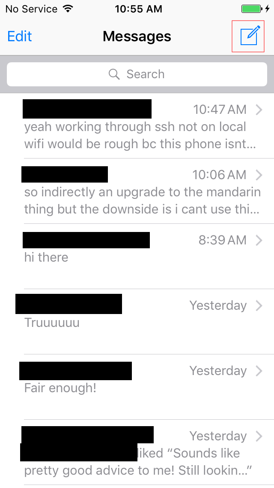
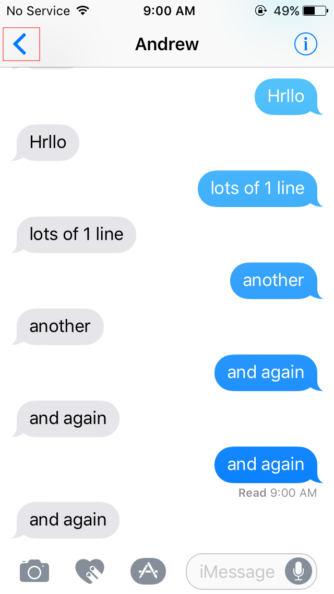
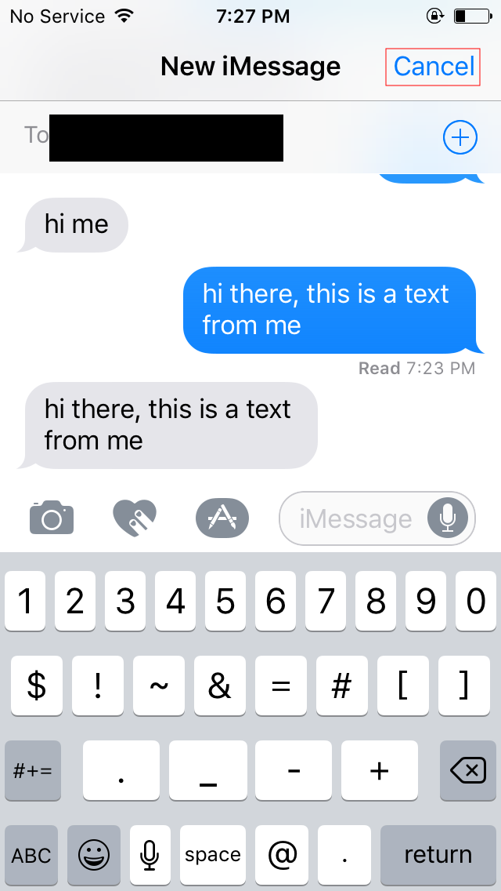
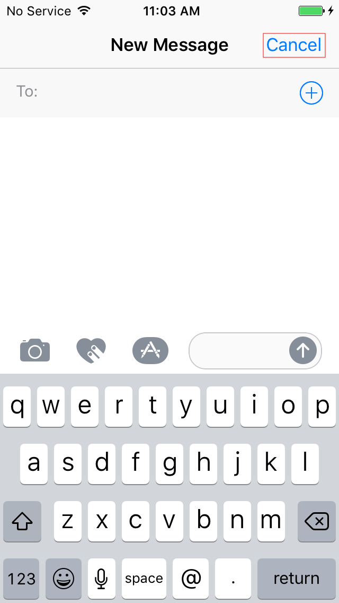
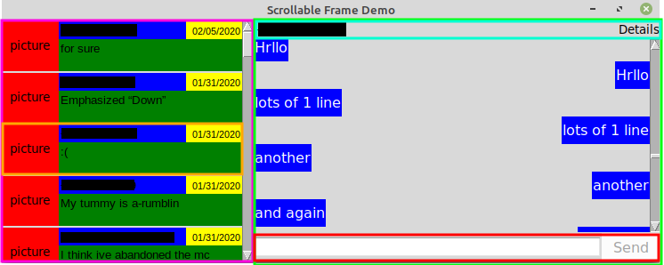

# iMessage for Linux
----
## First, some caveats...
Sadly, this solution requires an actual Apple device. In my case, I had an old iPhone 5 laying around. Apple, somewhat understandably, wants to make it as difficult as possible for non-iPhone owners to join the blue bubble group. This meant that I could either use a significant amount of my time attempting to find a way around their protections, or I could just actually use their hardware and automate sending/receiving of messages on said hardware.

Sending messages is relatively trivial to do on a MacBook. AppleScript is a language preinstalled on these devices that allows users to automate a variety of the stock Apple apps. However, this meant either I buy a used MacBook and leave it on constantly or run a Hackintosh VM on my desktop. I have previously tried a Hackintosh VM, although getting iMessage to work on it required giving up the ability to use my MacBook to send/receive iMessage. Buying a MacBook (or a much cheaper Mac Mini) meant dropping a potentially significant amount of money and then using a significant amount of power leaving it on and running Apple bloatware just to get messages. Therefore, although this solution would have been much less time spent, it would have cost more (both startup and power over time). Additionally, AppleScript doesn't have a way to react to messages or anything more complicated than sending messages. Even using a MacBook, I would need to find a way to automate things like reactions.

Because of these reasons, I decided to continue on with the old iPhone. For reference, this is an iPhone 5 running ios 10.3.4. The model and ios are not that important, as long as there exists a jailbreak for the combination of hardware and software.

Going in, I knew very little about what the internal file structure of the iPhone looked like. I figured that the messages were stored in some kind of database and was hoping it would be fairly easy to find. After jailbreaking the phone and installing openSSH through cydia, I sshed into the phone to take a look around. Finding the database where messages were stored was luckily simple. A combination of the find command, looking for anything with a .db extension, and grep to search for keywords like messages, sms, and imessage led me to the sqlite database sms.db. This database contained several tables, with the most important ones being message, chat, and handle. Sadly, there doesn't seem to be a lot of public documentation for how the various fields in the tables are used. What I have learned is through trial and error so it is always possible that I have misunderstood a field or missed an edge case. I will give a very, very brief overview of each of the three aforementioned tables.

##### message
The message table contains information about each message (both iMessages and SMS). This includes obvious things, like the actual text component of the message, time received, time delivered, time read, etc. However, since iMessage sends its various "extra features", like reactions or audio memos, as messages, there are also many other fields required. For example, when a reaction is sent, it is coded as a message with the text "{Reaction} "{Text of message reacting to}"" with the field associated_message_guid as the GUID of the message the reaction is meant for and the field associated_message_type is set to a value between 2000-2005 for one of the various reactions. There are around 60 total fields in this table, many of which I have yet to determine a use for since they aren't useful for this project.

##### handle
From just the information in the message table, there is no way to determine who sent what text. Instead, there is a handle_id field. Messages in a single way conversation have the same handle_id, regardless if I sent them or I received them. In groups, messages sent by me have handle_id 0, while messages sent by others have a handle_id equal to the handle_id of the messages sent in a single way conversation with them (if one exists). This handle_id in message can be matched up with a ROWID (primary key) in the handle table. The handle table stores information about the number associated with the handle, the country, and the type of service (SMS vs iMessage). A number can have multiple handles if there are both SMS and iMessages from them.

##### chat
The chat table holds information about each "chat", which includes all the different group chats and single way conversations on the device. This holds information about the conversation like whether it is a group, the current display name (if it's a group), and whether it is an iMessage or SMS conversation. This table DOES NOT hold information about who is in a group chat. The people in a single way chat can be gathered indirectly from this, but it is simpler (and probably safer) to grab them in the same way people in a group are grabbed via the join tables.

##### Join Tables
There are several tables that relate rows of the previously discussed tables to each other. These tables are used to match messages up with a specific chat and handles up with a specific chat.

## Essential Parts
This project is split into three distinct parts.

1. Remote code
2. Local message database
3. Local GUI

## Remote Code
The remote code includes all code that is on the iPhone. This includes a lua script for sending messages and reacting and two simple python scripts to either a) add a message to an outgoing queue or b) retrieve messsage data from the iPhone's sms.db and return it.

### Sending Messages
Ideally, I would be able to send messages from the commandline through ssh. If I had the time, resources, and skill, it could be possible to find a way to emulate the Messages app and add in my own hooks. With my current level of knowledge, this seemed like the wrong path to take. There are certain jailbreaks that sent texts for you. However, jailbreak apps that allowed this (specifically biteSMS) were too old for ios 10.3.4 and aren't open source. Using a tweak like Activator, which allows users to "activate" an action from the commandline, came with the restriction that you can't "create" custom actions from the commandline. If I wanted to send "Hello World" to the number +1(555)555-5555, I would have to create that action through the GUI. I attempted to find ways to create a single action and change the text after creation, but doing so only resulted in the name of the action changing, and not the action itself. Eventually, I decided to use a jailbreak app, AutoTouch, to automate the taps and swipes required to send a message.

### AutoTouch
AutoTouch is an app that allows you to run custom lua scripts and provides hooks that allow you to do things like simulate a tap at some (x, y), open and close apps, and detect images onscreen. With this, I am able to send and react to messages. Unfortunately, this means that I only have as much information as the screen currently shows. For example, if two group chats have the same name, and one is currently open, I can't determine which group I'm in without using AutoTouch to check the messages in the chat and comparing them to messages in the db. My lua script constantly checks a message queue (implemented as another sqlite3 db). When a message is detected, the script opens up the messages app.

In the simplest case, the script simply needs to send a message to a single person. Other cases (specifically groups) require a slightly different route to send a message.

There are three states that the message app could be in. Either the default view, where the list of all conversations is displayed, the compose view, where the user can compose a new message to recipients, or the conversation view, where the user can see all the messages of a specific conversation. 

The goal of my script is to first go to the default view, then go to the compose view. Here it will enter the recipients and the message to send, then send it. This puts the Message app into the conversation view state. The script then attempts to go back to the default view. This is not strictly required, as the script can handle any of the states, but it does make it faster for future messages and mitigates unintended consequences like sending read receipts. The code to determine and move state is found below.

	NOT_IN_MESSAGES = 1
	CONVERSATION_LIST_STATE = 2
	CONVERSATION_STATE = 3
	COMPOSE_STATE = 4

	function findComposeButton()
		--findImage is an AutoTouch library function
		--"images/compose.png" is a screenshot I took of the compose button, which only exists in the default (conversation list) state
		-- 1 indicates the number of objects I'm looking for (I'm only looking for one compose button)
		-- 0.99 is the threshold for success in finding the image
		-- The table {558, 55, 55, 55} specifies where to look for the compose button. This says to look at the rectangular area with upper left corner (558, 55) and width of 55 and height of 55
		-- This value is dependent on the hardware (and potentially ios) you are using
		return findImage("images/compose.png", 1, 0.99, {558, 55, 55, 55})
	end

	function findBackButton()
		return findImage("images/back.png", 1, 0.99, {17, 57, 40, 55})
	end

	function findCancelButton()
		return findImage("images/cancel.png", 1, 0.99, {495, 60, 120, 45})
	end

	function determineState()
		local appId = frontMostAppId();
		if appId ~= "com.apple.MobileSMS" then
			return NOT_IN_MESSAGES
		end
		if #findComposeButton() ~= 0 then
			return CONVERSATION_LIST_STATE
		elseif #findBackButton() ~= 0 then
			return CONVERSATION_STATE
		elseif #findCancelButton() ~= 0 then
			return COMPOSE_STATE
		end
		return NOT_IN_MESSAGES
	end

	function getToState(n)
		local stateMap = {
			{noop, openMessages, openMessages, openMessages},
			{unimplemented, noop, unimplemented, tapComposeButton},
			{unimplemented, tapBackButton, noop, tapBackButton},
			{unimplemented, tapCancelButton, tapCancelButton, noop}}
		repeat
			local state = determineState()
			stateMap[state][n]()
			sleep(1)
		until determineState() == n
	end

The three message app states are shown below. Note that the compose state has two "sub-states", one in which the recipients can still be added to and one in which the recipient list is locked. The red boxes indicate the identifying feature of the state.

##### Conversation List State

##### Conversation State

##### Compose States

The 2d `statemap` table is setup so that stateMap[x][y] is a function that takes you from state x towards state y. In some cases, the app cannot go straight from state x to state y, so the new state will be neither x nor y. For example, if you want to go from the conversation state to the compose state, you first have to go the default (conversation list) state. In the case of going from the NOT_IN_MESSAGES state, it is unknown what state you will end up in until you actually open the message app. I run determineState every iteration in order to make the script more robust. Assuming that running a function guarantees a transition to the next state introduces more race conditions and might not be able to handle crashes. In the potential scenario that it checks mid transition, none of the states will be recognized and the script will attempt to open the Messages app. If this is already open, this call is harmless. This makes the script fairly robust, allowing it to send messages even if someone were to try to stop the phone.

Once the script finds the phone in the COMPOSE state, the script enters in the recipient number and the message to send. Then it hits the send button and the message is en route to its destination.

### Getting Messages On and Off the Device
AutoTouch only handles the actual sending of the messages. In order to queue a message for sending, a local machine ssh's into the iPhone and runs a script at a location configured in the local code, passing along info about the recipient and the message. The python script on the iPhone that handles this is fairly trivial. It simply takes the recipient data and the message and populates them in a message queue, really an sqlite3 db, that the AutoTouch lua script checks. The entirity of the script is below.

	import sqlite3

	conn = sqlite3.connect('msgQueue.db')

	conn.execute('insert into outgoing (text, chatId) values ( ?, ? )', text, chatId)

This version only handles the case of sending a message. The chatId value is passed to the script instead of information about the recipient(s) for simplicity and to handle the case where a group is updated on the iPhone (by adding or removing a group member) but has yet to propogate this information to the local machine. The AutoTouch script is responsible for taking this chatId and getting the proper recipients from sms.db.

Getting information off the device is a little trickier. Ideally, only updated information would be transferred back to the local machine. There is likely a way to do this by altering the db to store some last updated value. However, I really did not want to alter the sms database since I have no knowledge of how that might affect the rest of the system. Instead, I check for any messages that have a date value (delivered/received or read) after the last time the program checked. The last time is passed from the local machine in order to allow for multiple machines to access the same iPhone without "stealing" messages from each other. Once the messages to be updated are identified, the script grabs all the rows from the handle, chat, and join tables that are related to these messages. All of these values are loaded into a dictionary, transformed into json text, and passed back to the local machine. There are definitely some optimizations that I could make here to reduce sending redundant information back to the local machine. For example, it is unlikely that the chat participants will change on any given message and passing back this information every time in a large group (20+ people) would quickly become a problem. There are specific messages that indicate a chat participant addition/subtraction, so I could check for those and only send chat information back if those messages have been sent.

An interesting issue that I ran into here was that on the iPhone, pip, a tool for grabbing python libraries, doesn't work. Additionally, the only python version available for this ios was python 2.5, which is one of the last versions to not include the json library in the install. The solution to this was to grab the source for simplejson (a json library that works from 2.4+) and manually install it on the iPhone. Not a very difficult issue, but definitely a surprising one since I had expected json support to be out of the box for almost any python install.

## Local Message Database
On the local machine, a stripped down copy of the sms.db is kept. This is kept purely for caching purposes. This could be removed, but then there would be no local copy of the messages. This would not remove the need for code that asks the iPhone for database updates, it would just remove the need to update the local db.

In order to maintain the local db, the updater.py script is run. Every second, it attempts to ssh into the iPhone and retrieve updates. These updates are returned as a json string. The script parses this json to recreate the updates and propagates them into the local db. The script passes the last access time to the script on the iPhone in order to account for slight delays in retrieval/updating. This means that messages can be retrieved more than once as "updated", but this just causes a small amount of unnecessary attempts to update information that hasn't changed.

## Local GUI
The final part of this project is the interface that allows the user to see and send messages. I attempted to make this as close to the Message app as possible in terms of layout and functionality. The GUI is written in python and uses the tkinter library. The GUI interacts with the local db (to retrieve messages) and the iPhone (to send messages) through the api.py script. In theory, the GUI should be completely independent of the device the data is being retrieved from. Only the api.py and updater.py scripts need to be changed if the device the messages are sent/retrieved from changes.

The GUI is split into two main parts. The left half is called a ChatFrame and the right half is called a ResponseFrame in the code.

## ChatFrame
The ChatFrame is responsible for holding all of the information about available chats. This includes displaying information such as numbers, contact and group names, date/time of the last received message, the contents of the last message, and a contact picture. The ChatFrame is outlined by a purple border in the screenshot. Inside the ChatFrame are ChatButtons, which are actually just tkinter Frame widgets with click bindings to make them act like buttons. Actual tkinter buttons were not used due to the inability to display the required information in a reasonable way. Using a Frame object allows me to use the tkinter grid layout to arrange Label objects in such a way that the ChatButtons resemble the chat selectors in the MacOS message app. An example ChatButton is outlined in orange in the screenshot. Within this ChatButton there are Label objects for the contact image (red), the recipient(s) (blue), the last received date/time (yellow), and the last received message text (green).

## ResponseFrame
The ResponseFrame is responsible for displaying the contents of the selected conversation, as well as giving the user some way to identify the current conversation and send a message. The ResponseFrame is outlined in lime green in the screenshot. The ResponseFrame is constituted of a RecipientFrame, MessageFrame, and SendFrame. The RecipientFrame displays information about the current recipients and holds a "Details" label. The details label is currently inoperable, but will eventually show more detailed information about the group, similarly to how it's done in the MacOS message app. The RecipientFrame is outlined in cyan in the screenshot. The MessageFrame displays all of the texts in the current conversation. Currently, the MessageFrame displays all messages by default. This has the consequence of a) loading a lot of potentially unnecessary texts that take up memory and b) making the scrollbar semi-useless in longer text threads. This will eventually be updated. The MessageFrame does not have an outline in the screenshot, but should be self-explanatory. Finally, the SendFrame is responsible for letting users type in a message to send to the current conversation. The SendFrame is fairly simple and consists of just a modified tkinter Text widget and Button widget. The modified Text object is referred to as a ResponsiveText object in code, and works exactly like a regular text widget except on adding or removing contents, it sends out a <<TextModified>> event. This allows me to only allow the send button to be pressed if there are contents in the ResponsiveText object.