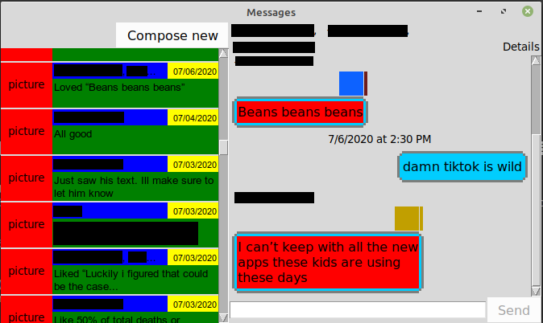

# iMessage for Linux
----
## Prerequisites
- Macbook connected to your Apple account
- Linux box to receive the messages on
- Port forwarding may be required if your Mac and Linux box are not on the same network

## Installation

## Essential Parts
This project is split into three distinct parts.

1. Remote code
2. Local message database
3. Local GUI

## Remote Code
The remote code is all of the code that resides on your Apple device. For Macbooks, there are several Python 3 scripts that are required.
1. addOutgoing.py - Adds messages that need to be sent to a sqlite3 db on the Macbook
2. autoMessage.py - Reads messages from the db written by addOutgoing.py and attempts to send them via the native Messages app
3. getMessages.py - Outputs info about messages in the Macbooks native chat.db for the Linux device to read

## Local message database and API
Much of the information from the chat.db sqlite3 database on the Macbook is transferred over to the Linux box and kept in a similar database. While the database itself has the same tables and schemas as the native Macbook one, not all of the information is actually transferred, as I have no need for it. There are also minor tweaks that have been made to the native chat.db so that the getMessages.py script can tell which messages to actually get.

The API included allows for data to be read from the copied database (or any similarly formatted database) and converted into objects like messages, attachments, and reactions. The API also allows for sending messages and reactions via a call to the remote addOutgoing.py script.

## GUI
The final part of this project is the interface that allows the user to see and send messages. I attempted to make this as close to the Message app as possible in terms of layout and functionality. The GUI is written in python and uses the tkinter library. The GUI uses the API to make sense of the information in the database.

The GUI is split into two main parts. The left half is called a ChatFrame (it summarizes the available "chats") and the right half is called a ResponseFrame (it shows the current conversation and allows for responding) in the code.

