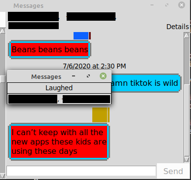

# iMessage for Linux
----
## Prerequisites
- Macbook connected to your Apple account
- Linux box to receive the messages on
- Port forwarding may be required if your Mac and Linux box are not on the same network

## Installation
The INSTALL script relies on the fact that you can connect to your Macbook via SSH. This may mean that you need to have already set up port forwarding.

It is **highly recommended** that you set up ssh keys before using this program. Failing to do so could mean that you need to type in your password every time the program attempts to ssh into the Macbook (which it does to retrieve messages). Setting up ssh keys in the INSTALL script is something that is currently being investigated.

If you are using Linux, you may be able to use the INSTALL script located in the top level directory in order to set up the forwarder. You will be prompted for the username of your account on the Macbook as well as the IP address of the Macbook.
Note that this installation script HAS NOT been tested on a wide variety of MacOS versions. It has only been tested with macOS Catalina version 10.15.3. If using a different version, feel free to open an issue to work through getting an INSTALL script for your version.

## TO-DO
If you feel that something should be added to the TO-DO list, please open an issue.

Shorter term goals include:
- Clean up autoMessage.py
- Optimize communication protocol between remote and local code
- Test on Windows
- Get a stable implementation of attachment sending in master

Longer term goals include:
- Translating the GUI and API to cpp
- Making the message API a standalone project
- Supporting more devices and OSes

## Essential Parts
This project is split into three distinct parts.

1. Remote code
2. Local message database
3. Local GUI

## Remote Code
The remote code is all of the code that resides on your Apple device. For Macbooks, there are several Python 3 scripts that are required.
1. addOutgoing.py - Adds messages that need to be sent to a sqlite3 db on the Macbook
2. autoMessage.py - Reads messages from the db written by addOutgoing.py and attempts to send them via the native Messages app
3. getMessages.py - Outputs info about messages in the Macbooks native chat.db for the Linux device to read

## Local message database and API
Much of the information from the chat.db sqlite3 database on the Macbook is transferred over to the Linux box and kept in a similar database. While the database itself has the same tables and schemas as the native Macbook one, not all of the information is actually transferred, as I have no need for it. There are also minor tweaks that have been made to the native chat.db so that the getMessages.py script can tell which messages to actually get.

The API included allows for data to be read from the copied database (or any similarly formatted database) and converted into objects like messages, attachments, and reactions. The API also allows for sending messages and reactions via a call to the remote addOutgoing.py script.

## GUI
The final part of this project is the interface that allows the user to see and send messages. I attempted to make this as close to the Message app as possible in terms of layout and functionality. The GUI is written in python and uses the tkinter library. The GUI uses the API to make sense of the information in the database.

The GUI is split into two main parts. The left half is called a ChatFrame (it summarizes the available "chats") and the right half is called a ResponseFrame (it shows the current conversation and allows for responding) in the code.

Many colors are simply placeholder/debug colors that will be removed later in development.

A view of a typical group conversation. Numbers and emails have been blacked out.

A view of a "reaction window" where the user can clearly see which numbers are associated with which reactions on a given message.
Note that this window is only available in group chats, and can be accessed by right-clicking a message and selecting "Reactions".
